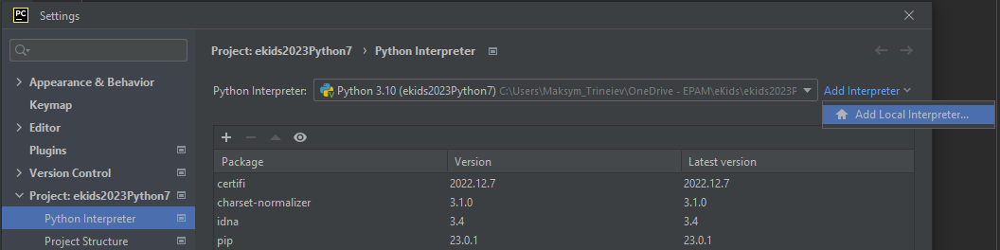
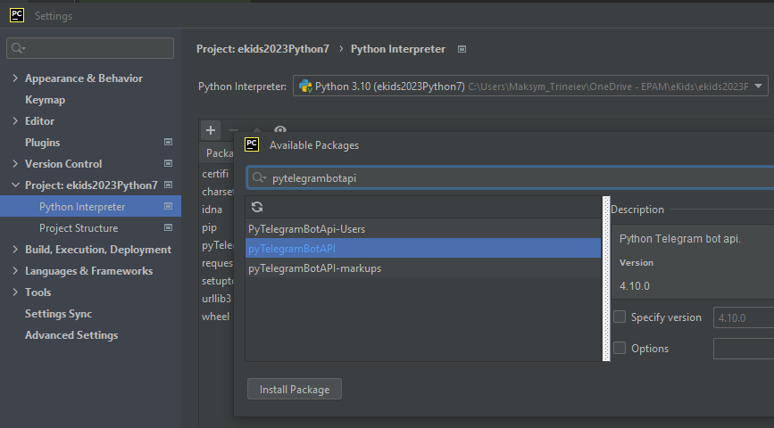
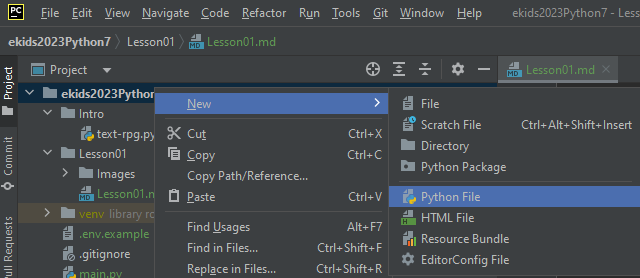
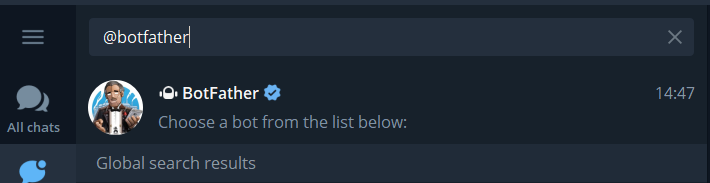
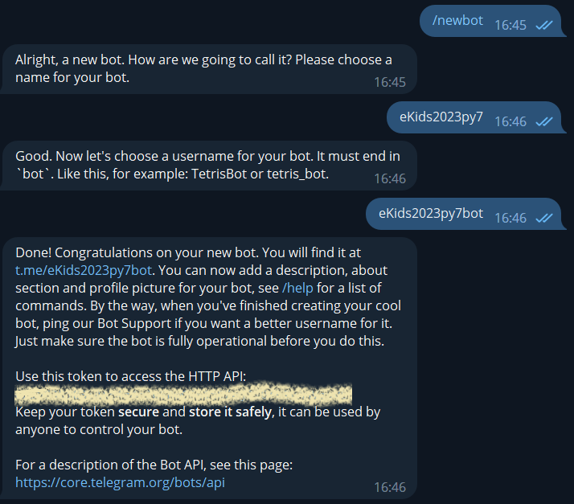
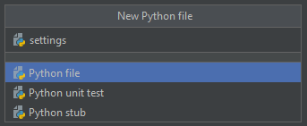

# Заняття №1

## План уроку
* Підготувати PyCharm для роботи з проектом
* Зареєструвати Телеграм бота
* Програмування (все helicopter view):
  * Імпорт модулів
  * Змінні
  * Типи
  * Функції
  * Умови
* Запустити бота та протестувати його роботу

## Підготовка до роботи з проектом в PyCharm

1. Створити віртуальне оточення venv:<br>
`File -> Settings -> Project -> Python Interpreter -> Add interpreter -> Add Local interpreter`<br>
<br><br>
2. Додати бібліотеку для роботи з Телеграм ботами:<br>
`File -> Settings -> Project -> Python Interpreter -> + -> pytelegrambotapi -> Install Package`<br>
<br>
або відкрити Terminal та виконати команду `pip install pytelegrambotapi`<br><br>
3. Створити головний скрипт `main.py`<br>
`Right click on project name -> New -> Python file -> Type "main" -> Click on Python file`<br>
<br><br>


## Створити Телеграм бота та підготуватися до роботи з ним

1. Відкриваємо в Телеграм `@BotFather`<br>
<br><br>
2. Вводимо команду `/newbot`, після чого називаємо свого бота та даємо йому ім'я користувача<br>
<br><br>
3. В PyCharm створюємо файл `settings.py` для збереження ключа Телеграм бота<br>
`Right click on project name -> New -> Python file -> Type "settings" -> Click on Python file`<br>
<br>
Та додаємо у нього токен створеного бота,
```python
BOT_TOKEN = "1234567890:AbCdE1234567890aBcDe1234567890AbCdE"
```

Ми створили нового бота та підготували PyCharm для роботи з ним.

На заняттях викладачі працюють з ботом `@eKids2023py7`, студенти можуть
використовувати його для перевірки, одночасно студенти працюють виключно зі своїми створеними щойно ботами.
