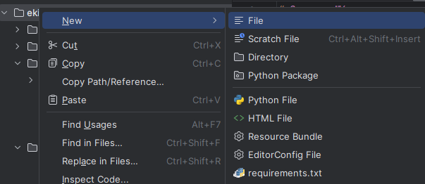

# Заняття №4

## План практичного заняття
* Обговорити із студентами структуру товару (dict)
* Створити масив товарів (глобальна змінна)
* Створити функцію для додавання товарів (команда `/add`)
* Створити функцію виводу списку товарів (команда `/print`)
* Оновити функцію обробки команди `/help`
* Створити файл для збереження товарів
* Створити процедури збереження та відновлення списку товарів
* Зробити друк товарів зручним для читання

### Створення файлу для збереження товарів

В PyCharm в директорії проекту створюємо файл `goods.json`
для збереження списку товарів 
`Right click on project name -> New -> File -> Type "goods.json" -> Enter`
  

  
Та додаємо у нього пустий список `[]`

Ми створили список товарів, функцію їх додавання та функцію друку списку
товарів, а також функції збереження та відновлення списку товарів.
