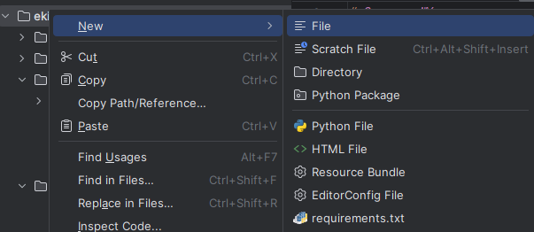

# Заняття №5

## План практичного заняття
* Створити файл для збереження товарів
* Відновити товари зі збереженого файлу
* Додати в функцію для додавання товарів збереження списку товарів
* Додати в функцію для додавання товарів перевірку на унікальність товару
* Створити функцію видалення товару (команда `/delete`)
* Оновити функцію обробки команди `/help`
* Зробити друк товарів зручним для читання

### Створення файлу для збереження товарів

В PyCharm в директорії проекту створюємо файл `goods.json`
для збереження списку товарів<br>
`Right click on project name -> New -> File -> Type "goods.json" -> Enter`
<br><br>

<br><br>
Та додаємо у нього список товарів
```json
[
  {
    "Назва": "Ручка",
    "Ціна": 10.5,
    "Опис": "Синя"
  },
  {
    "Назва": "Олівець",
    "Ціна": 12.0,
    "Опис": "Чорний графітовий"
  }
]
```

Ми створили список товарів, функцію їх додавання та функцію друку списку
товарів, а також функції збереження та відновлення списку товарів.
